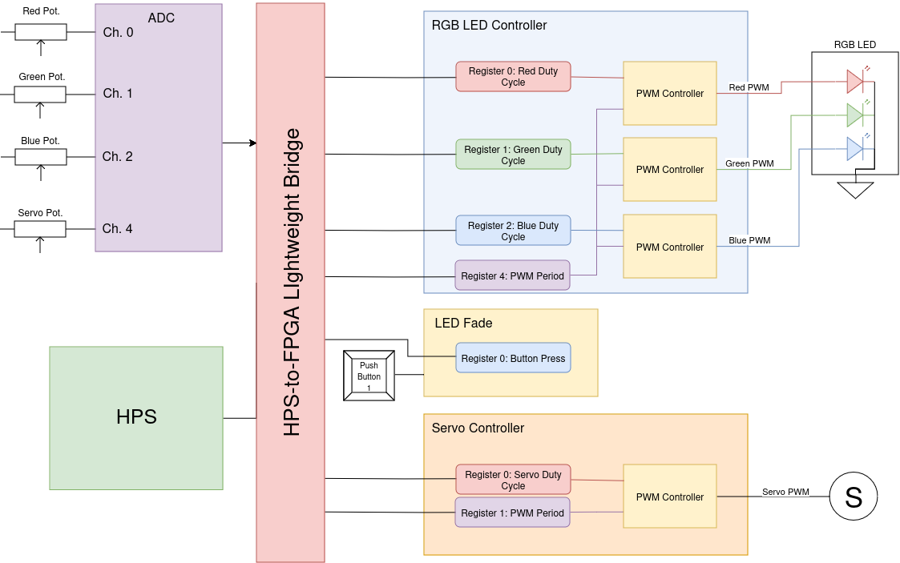

# System Overview

This system consists of VHDL, Platform Designer projects, and C code required to run an RGB LED with a push-button control alongside a servo on the DE-10 nano.

- System code
    - vhdl for required and custom components (pwm controller, avalon files, top level files)
    - A Device Tree that contains nodes for all drivers
    - Device Drivers for all components
    - Custom C code to perform specific software operations.

(See below for desc. on the custom components)

## Memory Map for Registers

| 0xff200000 | ... | 0xff201000 | 0xff201001 | 0xff201002 | ... | 0xff202000 | 0xff202002 | ... | 0xff27ad4f | 0xff27ad50 | 0xff27ad51 | 0xff27ad52 | 0xff27ad53 |
| ---    | ---   | ---     | ---    | ---    | ---    | ---    | ---    | ---    | ---    | ---    | ---    | ---    | ---    |
| Base for ADC  | ... | Base for Servo | duty cycle | period register | ... | Base for RGB Button | Button Press Register | ... | Base for RGB | duty cycle red | duty cycle green | duty cycle blue | period register |

## Block Diagram

The main hardware in this design is the RGB LED controller, which creates 3 PWM controllers with their respective registers to drive the RGB LED. Thes eregisters are used as inputs to the PWM controller, which outputs PWM signals for the red, green, and blue LED. Registers for the red, green, and blue duty cycles as well as the PWM period are connected to the bridge, allowing for read and write from the HPS.  
For the servo controller, an identical approach is used to control a seperate servo PWM signal.  

For the push button input, a hardware component with a single register is connected to push button 1 of the de-10 nano, then connected to the bridge. 

Finally, 4 potentiometers are connected to the de-10 nano's bottom 4 ADC channels. These ADC channel values are once again connected to the bridge 

From this point, the HPS system can read/write to any register in the system over the bridge. Potentiometer values are taken in, converted to their respective PWM duty cycle values in software, and then written over the bridge to the corresponding registers. For the LED Fade component, the button press register is read, and the values in the red, green, and blue duty cycles are decremented if the register indicates the button is held.

# Custom Component 1 - rgb button

This component implements taking input from push button 1 on the de-10 nano. When the button is pressed and held, the RGB led will slowly start to fade until it is turned off.

# Custom Component 2 - servo motor

This component takes input from a potentiometer, this ADC signal is converted to a pwm signal, and then sent to a GPIO pin that outputs to a servo motor.